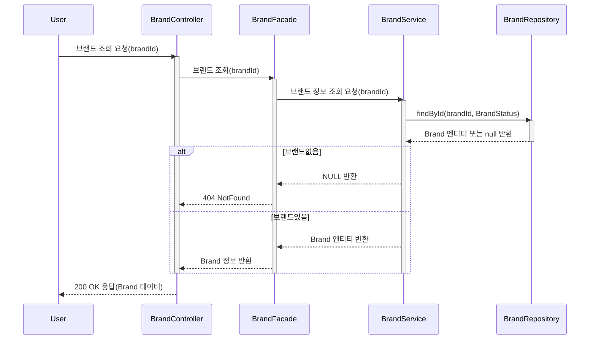
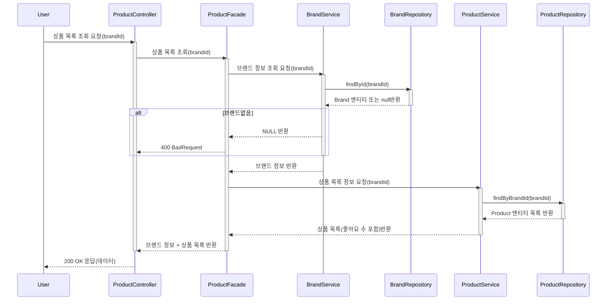
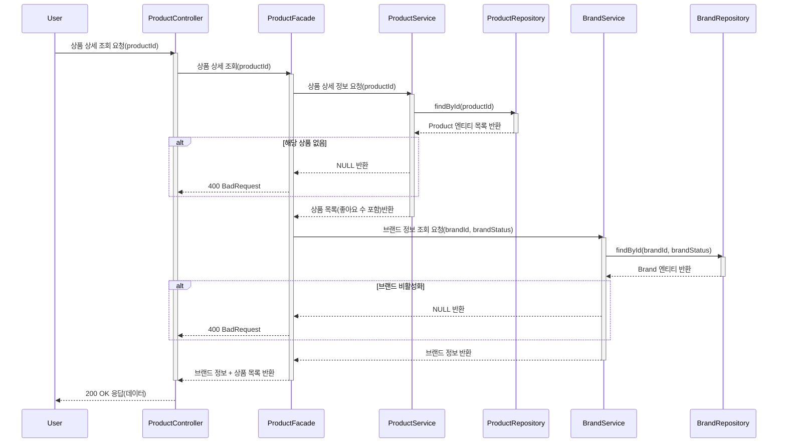
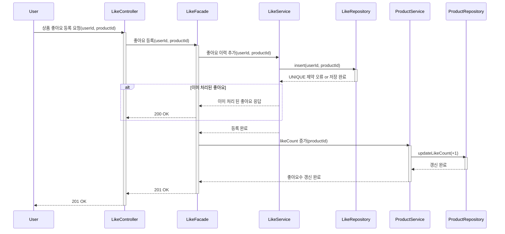
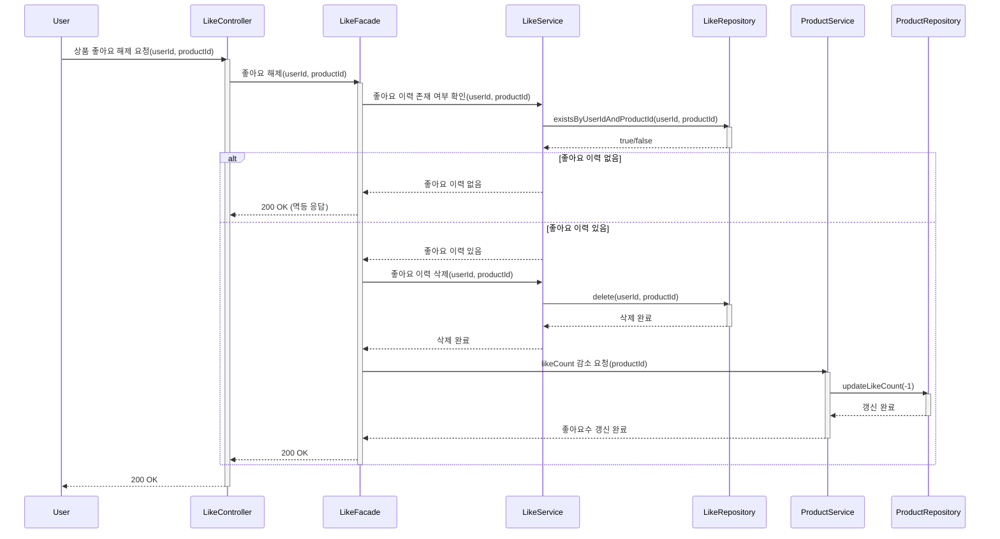
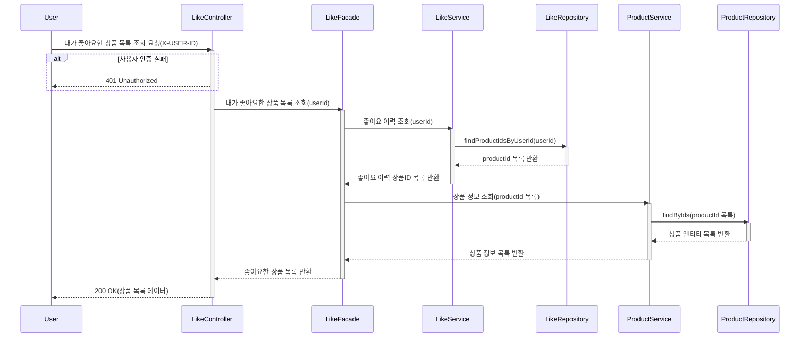
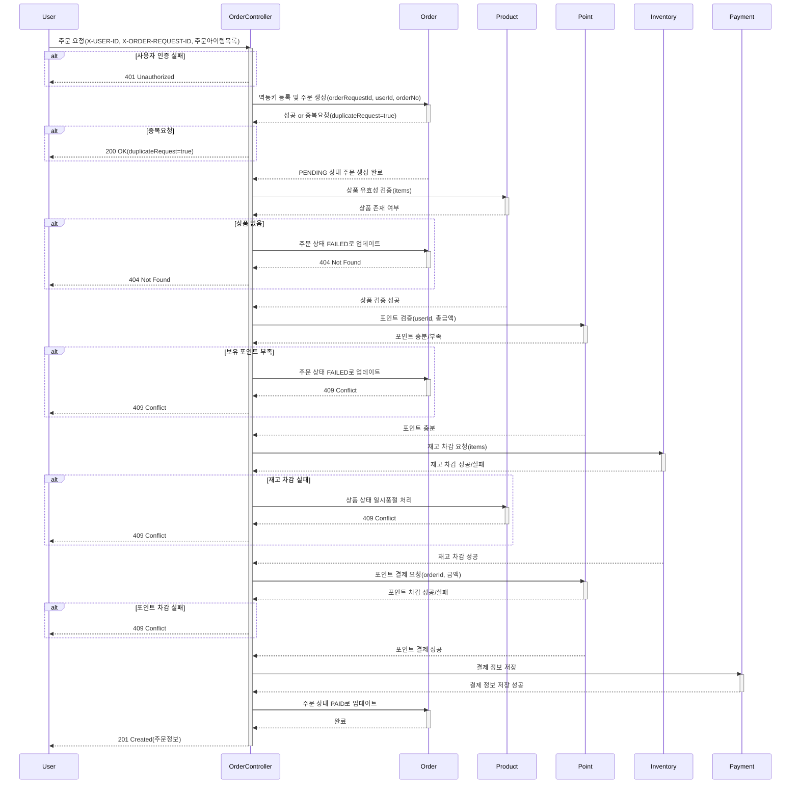
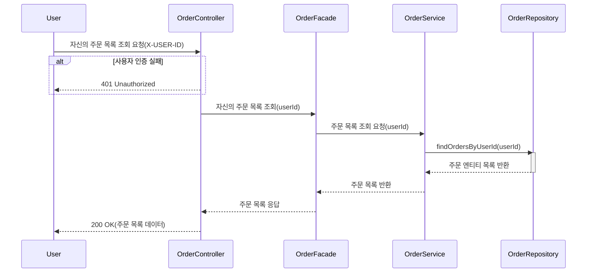
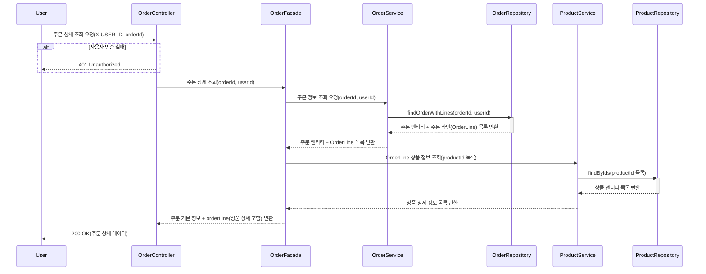

| 시퀀스 다이어그램

---

# 1 브랜드 조회

```mermaid
sequenceDiagram
    participant USER as User
    participant CON as BrandController
    participant FA as BrandFacade
    participant BS as BrandService
    participant BR as BrandRepository

    USER->>CON: 브랜드 조회 요청(brandId)
    activate CON

        CON->>FA: 브랜드 조회(brandId)
        activate FA
            FA->>BS: 브랜드 정보 조회 요청(brandId)
            activate BS
                BS->>BR: findById(brandId, BrandStatus)
                activate BR
                    BR-->>BS: Brand 엔티티 또는 null 반환
                deactivate BR

                alt 브랜드없음
                    BS-->>FA: NULL 반환
                    FA-->>CON: 404 NotFound
                else 브랜드있음
                    BS-->>FA: Brand 엔티티 반환
                    FA-->>CON: Brand 정보 반환
                end
            deactivate BS
        deactivate FA

    deactivate CON
    CON-->>USER: 200 OK 응답(Brand 데이터)

```

---

# 2 상품 목록 조회

```mermaid
sequenceDiagram
    participant USER as User
    participant CON as ProductController
    participant FA as ProductFacade
    participant BS as BrandService
    participant BR as BrandRepository
    participant PS as ProductService
    participant PR as ProductRepository

    USER->>CON: 상품 목록 조회 요청(brandId)
    activate CON
        
        CON->>FA: 상품 목록 조회(brandId)
        activate FA
            FA->>BS: 브랜드 정보 조회 요청(brandId)
            activate BS        
                BS->>BR: findById(brandId)        
                activate BR
                BR-->>BS: Brand 엔티티 또는 null반환    
                deactivate BR

                alt 브랜드없음            
                    BS-->>FA: NULL 반환 
                    FA-->>CON: 400 BadRequest
                end

            deactivate BS
            BS-->>FA: 브랜드 정보 반환
            FA->>PS: 상품 목록 정보 요청(brandId)
            activate PS
                PS->>PR: findByBrandId(brandId)
                activate PR
                    PR-->>PS: Product 엔티티 목록 반환
                deactivate PR
                PS-->>FA: 상품 목록(좋아요 수 포함)반환
            deactivate PS
            
            
            FA-->>CON: 브랜드 정보 + 상품 목록 반환
        deactivate FA
    deactivate CON
    CON-->>USER:200 OK 응답(데이터)

```

---

# 3 상품 상세 조회

```mermaid
sequenceDiagram
    participant USER as User
    participant CON as ProductController
    participant FA as ProductFacade
    participant PS as ProductService
    participant PR as ProductRepository
    participant BS as BrandService
    participant BR as BrandRepository

    USER->>CON: 상품 상세 조회 요청(productId)
    activate CON

    CON->>FA: 상품 상세 조회(productId)
    activate FA
        
        FA->>PS: 상품 상세 정보 요청(productId)
        activate PS
        PS->>PR: findById(productId)
        activate PR        
            PR-->>PS: Product 엔티티 목록 반환
        deactivate PR
        alt 해당 상품 없음
            PS-->>FA: NULL 반환
            FA-->>CON: 400 BadRequest
        end
                
        PS-->>FA: 상품 목록(좋아요 수 포함)반환
        deactivate PS

        FA->>BS: 브랜드 정보 조회 요청(brandId, brandStatus)
        activate BS
            BS->>BR: findById(brandId, brandStatus)
            activate BR
                BR-->>BS: Brand 엔티티 반환
            deactivate BR

            alt 브랜드 비활성화 
                BS-->>FA: NULL 반환
                FA-->>CON: 400 BadRequest
            end
            BS-->>FA: 브랜드 정보 반환
        deactivate BS
    
        FA-->>CON: 브랜드 정보 + 상품 목록 반환
    deactivate FA
    deactivate CON
    CON-->>USER:200 OK 응답(데이터)

```

---

# 4 좋아요 등록

```mermaid
sequenceDiagram
    participant USER as User
    participant CON as LikeController
    participant FA as LikeFacade
    participant LS as LikeService
    participant LR as LikeRepository
    participant PS as ProductService
    participant PR as ProductRepository

    USER->>CON: 상품 좋아요 등록 요청(userId, productId)

    activate CON
        CON->>FA: 좋아요 등록(userId, productId)    
        
        activate FA        
        
            %% 2. 좋아요 이력 등록
            FA->>LS: 좋아요 이력 추가(userId, productId)
            
            LS->>LR: insert(userId, productId)
            activate LR            
                LR-->>LS: UNIQUE 제약 오류 or 저장 완료
            deactivate LR
                alt 이미 처리된 좋아요
                    LS-->>FA: 이미 처리 된 좋아요 응답
                    FA-->>CON: 200 OK                
                end
            
            
            LS-->>FA: 등록 완료

            
            %% 3. 상품 likeCount 증가
            FA->>PS: likeCount 증가(productId)
            activate PS
                PS->>PR: updateLikeCount(+1)
                activate PR
                    PR-->>PS: 갱신 완료
                deactivate PR                
                PS-->>FA: 좋아요수 갱신 완료
            deactivate PS   
        
        %% 4. 응답
        FA-->>CON: 201 OK
        deactivate FA            
    
    CON-->>USER: 201 OK
    deactivate CON
```

---

# 5 좋아요 해제 

```mermaid
sequenceDiagram
    participant USER as User
    participant CON as LikeController
    participant FA as LikeFacade
    participant LS as LikeService
    participant LR as LikeRepository
    participant PS as ProductService
    participant PR as ProductRepository

    USER->>CON: 상품 좋아요 해제 요청(userId, productId)

    activate CON
        CON->>FA: 좋아요 해제(userId, productId)

        activate FA

            %% 1. 좋아요 이력 존재 여부 확인
            FA->>LS: 좋아요 이력 존재 여부 확인(userId, productId)
            LS->>LR: existsByUserIdAndProductId(userId, productId)
            activate LR
                LR-->>LS: true/false
            deactivate LR

            alt 좋아요 이력 없음
                LS-->>FA: 좋아요 이력 없음
                FA-->>CON: 200 OK (멱등 응답)
            else 좋아요 이력 있음
                LS-->>FA: 좋아요 이력 있음

                %% 2. 좋아요 이력 삭제
                FA->>LS: 좋아요 이력 삭제(userId, productId)
                LS->>LR: delete(userId, productId)
                activate LR
                    LR-->>LS: 삭제 완료
                deactivate LR
                LS-->>FA: 삭제 완료

                %% 3. 상품 likeCount 감소
                FA->>PS: likeCount 감소 요청(productId)
                activate PS
                    PS->>PR: updateLikeCount(-1)
                    activate PR
                        PR-->>PS: 갱신 완료
                    deactivate PR
                    PS-->>FA: 좋아요수 갱신 완료
                deactivate PS

                %% 4. 응답
                FA-->>CON: 200 OK
            end

        deactivate FA

    CON-->>USER: 200 OK
    deactivate CON

```

---

# 6 좋아요 한 상품 목록

```mermaid
sequenceDiagram
    participant USER as User
    participant CON as LikeController
    participant FA as LikeFacade
    participant LS as LikeService
    participant LR as LikeRepository
    participant PS as ProductService
    participant PR as ProductRepository

    USER->>CON: 내가 좋아요한 상품 목록 조회 요청(X-USER-ID)
    activate CON

    alt 사용자 인증 실패
        CON-->>USER: 401 Unauthorized        
    end
        CON->>FA: 내가 좋아요한 상품 목록 조회(userId)
        activate FA

        FA->>LS: 좋아요 이력 조회(userId)
        activate LS
        LS->>LR: findProductIdsByUserId(userId)
        activate LR
        LR-->>LS: productId 목록 반환
        deactivate LR
        LS-->>FA: 좋아요 이력 상품ID 목록 반환
        deactivate LS

        FA->>PS: 상품 정보 조회(productId 목록)
        activate PS
        PS->>PR: findByIds(productId 목록)
        activate PR
        PR-->>PS: 상품 엔티티 목록 반환
        deactivate PR
        PS-->>FA: 상품 정보 목록 반환
        deactivate PS

        FA-->>CON: 좋아요한 상품 목록 반환
        deactivate FA
        CON-->>USER: 200 OK(상품 목록 데이터)
        deactivate CON    
```

---

# 7 주문 등록

```mermaid
sequenceDiagram
    participant USER as User
    participant CON as OrderController
    participant ORDER as Order
    participant PRODUCT as Product
    participant POINT as Point
    participant INVENTORY as Inventory
    participant PAYMENT as Payment

    USER->>CON: 주문 요청(X-USER-ID, X-ORDER-REQUEST-ID, 주문아이템목록)

    activate CON
    alt 사용자 인증 실패
        CON-->>USER: 401 Unauthorized
    end

    CON->>ORDER: 멱등키 등록 및 주문 생성(orderRequestId, userId, orderNo)
    activate ORDER
    ORDER-->>CON: 성공 or 중복요청(duplicateRequest=true)
    deactivate ORDER

    alt 중복요청
        CON-->>USER: 200 OK(duplicateRequest=true)
    end

    ORDER-->>CON: PENDING 상태 주문 생성 완료

    CON->>PRODUCT: 상품 유효성 검증(items)
    activate PRODUCT
    PRODUCT-->>CON: 상품 존재 여부
    deactivate PRODUCT

    alt 상품 없음
        CON->>ORDER: 주문 상태 FAILED로 업데이트
        activate ORDER
        ORDER-->>CON: 404 Not Found
        deactivate ORDER
        CON-->>USER: 404 Not Found
    end

    PRODUCT-->>CON: 상품 검증 성공

    CON->>POINT: 포인트 검증(userId, 총금액)
    activate POINT
    POINT-->>CON: 포인트 충분/부족
    deactivate POINT

    alt 보유 포인트 부족
        CON->>ORDER: 주문 상태 FAILED로 업데이트
        activate ORDER
        ORDER-->>CON: 409 Conflict
        deactivate ORDER
        CON-->>USER: 409 Conflict
    end

    POINT-->>CON: 포인트 충분

    CON->>INVENTORY: 재고 차감 요청(items)
    activate INVENTORY
    INVENTORY-->>CON: 재고 차감 성공/실패
    deactivate INVENTORY

    alt 재고 차감 실패
        CON->>PRODUCT: 상품 상태 일시품절 처리
        activate PRODUCT
        PRODUCT-->>CON: 409 Conflict
        deactivate PRODUCT
        CON-->>USER: 409 Conflict
    end

    INVENTORY-->>CON: 재고 차감 성공

    CON->>POINT: 포인트 결제 요청(orderId, 금액)
    activate POINT
    POINT-->>CON: 포인트 차감 성공/실패
    deactivate POINT

    alt 포인트 차감 실패
        CON-->>USER: 409 Conflict
    end

    POINT-->>CON: 포인트 결제 성공

    CON->>PAYMENT: 결제 정보 저장
    activate PAYMENT
    PAYMENT-->>CON: 결제 정보 저장 성공
    deactivate PAYMENT

    CON->>ORDER: 주문 상태 PAID로 업데이트
    activate ORDER
    ORDER-->>CON: 완료
    deactivate ORDER

    CON-->>USER: 201 Created(주문정보)
    deactivate CON
```

---

# 8 주문 목록 조회

```mermaid
sequenceDiagram
    participant USER as User
    participant CON as OrderController
    participant FA as OrderFacade
    participant OS as OrderService
    participant OR as OrderRepository

    USER->>CON: 자신의 주문 목록 조회 요청(X-USER-ID)

    alt 사용자 인증 실패
        CON-->>USER: 401 Unauthorized
    end

    CON->>FA: 자신의 주문 목록 조회(userId)

    FA->>OS: 주문 목록 조회 요청(userId)
    OS->>OR: findOrdersByUserId(userId)
    activate OR
    OR-->>OS: 주문 엔티티 목록 반환
    deactivate OR
    OS-->>FA: 주문 목록 반환

    FA-->>CON: 주문 목록 응답
    CON-->>USER: 200 OK(주문 목록 데이터)

```

---

# 9 주문 상세 조회

```mermaid
sequenceDiagram
    participant USER as User
    participant CON as OrderController
    participant FA as OrderFacade
    participant OS as OrderService
    participant OR as OrderRepository
    participant PS as ProductService
    participant PR as ProductRepository

    USER->>CON: 주문 상세 조회 요청(X-USER-ID, orderId)

    alt 사용자 인증 실패
        CON-->>USER: 401 Unauthorized
    end

    CON->>FA: 주문 상세 조회(orderId, userId)

    FA->>OS: 주문 정보 조회 요청(orderId, userId)
    OS->>OR: findOrderWithLines(orderId, userId)
    activate OR
    OR-->>OS: 주문 엔티티 + 주문 라인(OrderLine) 목록 반환
    deactivate OR
    OS-->>FA: 주문 엔티티 + OrderLine 목록 반환

    %% OrderLine 내부에 productId 목록이 있음
    FA->>PS: OrderLine 상품 정보 조회(productId 목록)
    PS->>PR: findByIds(productId 목록)
    activate PR
    PR-->>PS: 상품 엔티티 목록 반환
    deactivate PR
    PS-->>FA: 상품 상세 정보 목록 반환

    FA-->>CON: 주문 기본 정보 + orderLine(상품 상세 포함) 반환
    CON-->>USER: 200 OK(주문 상세 데이터)

```