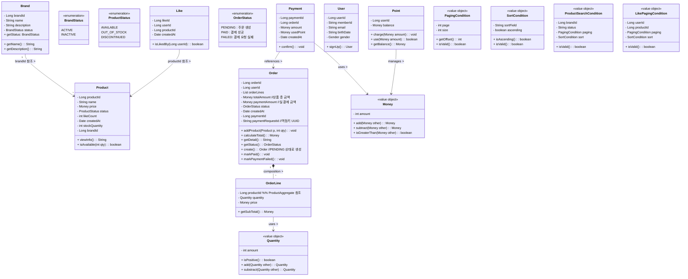
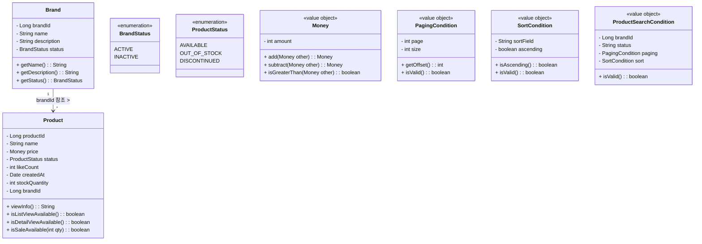
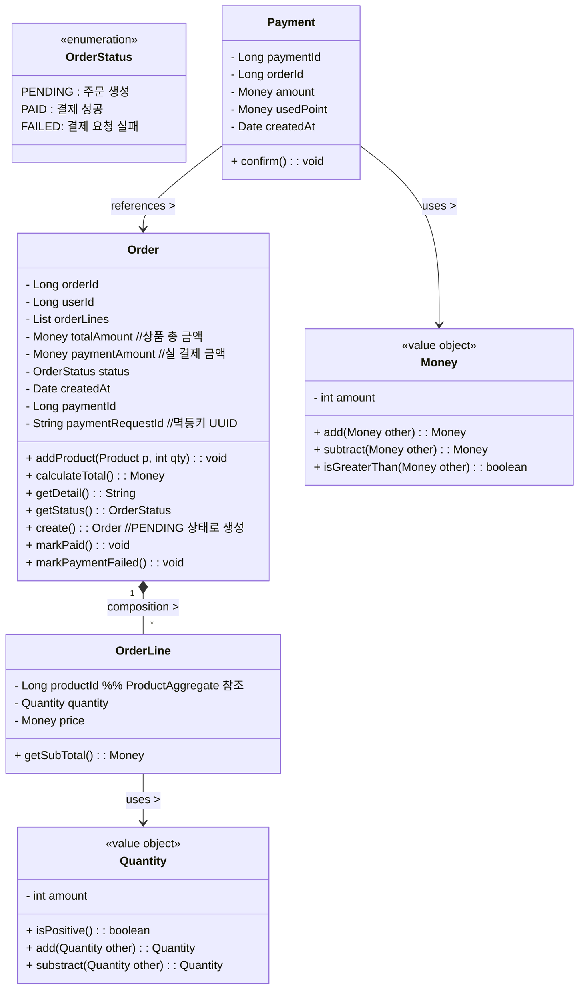
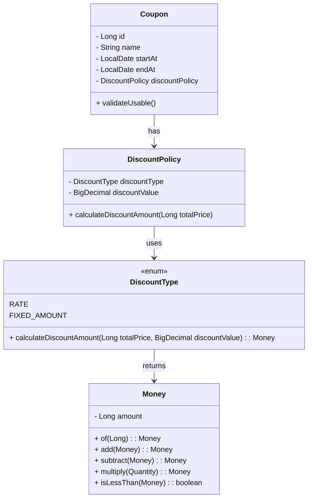

| 클래스 다이어그램

---

```mermaid
classDiagram
%% =========================
%% BrandAggregate
%% =========================
class Brand {
    - Long brandId
    - String name
    - String description
    - BrandStatus status
    + getName(): String
    + getDescription(): String
    + getStatus: BrandStatus
}

class BrandStatus {
    <<enumeration>>
    ACTIVE
    INACTIVE
}

Brand "1" --> "*" Product : brandId 참조 >

%% =========================
%% ProductAggregate
%% =========================
class Product {
    - Long productId
    - String name
    - Money price
    - ProductStatus status
    - int likeCount
    - Date createdAt
    - int stockQuantity
    - Long brandId
    + viewInfo(): String
    + isAvailable(int qty): boolean
}

class ProductStatus {
    <<enumeration>>
    AVAILABLE
    OUT_OF_STOCK
    DISCONTINUED
}

%% =========================
%% LikeAggregate
%% =========================
class Like {
    - Long likeId
    - Long userId
    - Long productId  
    - Date createdAt    
    + isLikedBy(Long userId): boolean
}

%% LikeAggregate 
Like --> Product : productId 참조 >

%% =========================
%% OrderAggregate
%% =========================
class Order {
    - Long orderId
    - Long userId
    - List<OrderLine> orderLines
    - Money totalAmount //상품 총 금액
    - Money paymentAmount //실 결제 금액 
    - OrderStatus status
    - Date createdAt
    - Long paymentId
    - String paymentRequestId //멱등키 UUID
    + addProduct(Product p, int qty): void
    + calculateTotal(): Money    
    + getDetail(): String
    + getStatus(): OrderStatus
    + create(): Order //PENDING 상태로 생성 
    + markPaid(): void
    + markPaymentFailed(): void
}

class OrderLine {
    - Long productId  %% ProductAggregate 참조
    - Quantity quantity
    - Money price
    + getSubTotal(): Money
}

class Quantity {
    <<value object>>
    - int amount
    + isPositive(): boolean
    + add(Quantity other): Quantity
    + substract(Quantity other): Quantity
}

class OrderStatus {
    <<enumeration>>
    PENDING : 주문 생성 
    PAID  : 결제 성공 
    FAILED: 결제 요청 실패
}

Order "1" *-- "*" OrderLine : composition >
OrderLine --> Quantity : uses >

%% =========================
%% PaymentAggregate
%% =========================
class Payment {
    - Long paymentId
    - Long orderId  
    - Money amount
    - Money usedPoint
    - Date createdAt  
    + confirm(): void
}

Payment --> Order : references >
Payment --> Money : uses >

%% =========================
%% UserAggregate
%% =========================
class User {
    - Long userId
    - String memberId
    - String email
    - String birthDate
    - Gender gender
    + signUp(): User    
}

%% =========================
%% PointAggregate
%% =========================
class Point {
    - Long userId
    - Money balance
    + charge(Money amount): void
    + use(Money amount): boolean
    + getBalance(): Money
}

Point --> Money : manages >

%% =========================
%% 공통 VO
%% =========================
class Money {
    <<value object>>
    - int amount
    + add(Money other): Money
    + subtract(Money other): Money
    + isGreaterThan(Money other): boolean
}

%% =========================
%% 필터링 및 페이징 조건 VO
%% =========================
class PagingCondition {
    <<value object>>
    - int page
    - int size
    + getOffset(): int
    + isValid(): boolean
}

class SortCondition {
    <<value object>>
    - String sortField
    - boolean ascending
    + isAscending(): boolean
    + isValid(): boolean
}

class ProductSearchCondition {
    <<value object>>
    - Long brandId
    - String status
    - PagingCondition paging
    - SortCondition sort
    + isValid(): boolean
}

class LikePagingCondition {
    <<value object>>
    - Long userId
    - Long productId
    - PagingCondition paging
    - SortCondition sort
    + isValid(): boolean
}

```

---

1. 상품/브랜드 조회

```mermaid
classDiagram
%% =========================
%% BrandAggregate
%% =========================
class Brand {
    - Long brandId
    - String name
    - String description
    - BrandStatus status
    + getName(): String
    + getDescription(): String
    + getStatus(): BrandStatus
}

class BrandStatus {
    <<enumeration>>
    ACTIVE
    INACTIVE
}

Brand "1" --> "*" Product : brandId 참조 >

%% =========================
%% ProductAggregate
%% =========================
class Product {
    - Long productId
    - String name
    - Money price
    - ProductStatus status
    - int likeCount
    - Date createdAt
    - int stockQuantity
    - Long brandId
    + viewInfo(): String
    + isListViewAvailable(): boolean
    + isDetailViewAvailable(): boolean
    + isSaleAvailable(int qty): boolean
}

class ProductStatus {
    <<enumeration>>
    AVAILABLE
    OUT_OF_STOCK
    DISCONTINUED
}

%% =========================
%% 공통 VO
%% =========================
class Money {
    <<value object>>
    - int amount
    + add(Money other): Money
    + subtract(Money other): Money
    + isGreaterThan(Money other): boolean
}

%% =========================
%% 필터링 및 페이징 조건 VO
%% =========================
class PagingCondition {
    <<value object>>
    - int page
    - int size
    + getOffset(): int
    + isValid(): boolean
}

class SortCondition {
    <<value object>>
    - String sortField
    - boolean ascending
    + isAscending(): boolean
    + isValid(): boolean
}

class ProductSearchCondition {
    <<value object>>
    - Long brandId
    - String status
    - PagingCondition paging
    - SortCondition sort
    + isValid(): boolean
}

```

---

## 2. 주문/결제 

```mermaid
classDiagram
%% =========================
%% OrderAggregate
%% =========================
class Order {
    - Long orderId
    - Long userId
    - List<OrderLine> orderLines
    - Money totalAmount //상품 총 금액
    - Money paymentAmount //실 결제 금액 
    - OrderStatus status
    - Date createdAt
    - Long paymentId
    - String paymentRequestId //멱등키 UUID
    + addProduct(Product p, int qty): void
    + calculateTotal(): Money    
    + getDetail(): String
    + getStatus(): OrderStatus
    + create(): Order //PENDING 상태로 생성 
    + markPaid(): void
    + markPaymentFailed(): void
}

class OrderLine {
    - Long productId  %% ProductAggregate 참조
    - Quantity quantity
    - Money price
    + getSubTotal(): Money
}

class Quantity {
    <<value object>>
    - int amount
    + isPositive(): boolean
    + add(Quantity other): Quantity
    + substract(Quantity other): Quantity
}

class OrderStatus {
    <<enumeration>>
    PENDING : 주문 생성 
    PAID  : 결제 성공 
    FAILED: 결제 요청 실패
}

Order "1" *-- "*" OrderLine : composition >
OrderLine --> Quantity : uses >

%% =========================
%% PaymentAggregate
%% =========================
class Payment {
    - Long paymentId
    - Long orderId  
    - Money amount
    - Money usedPoint
    - Date createdAt  
    + confirm(): void
}

Payment --> Order : references >
Payment --> Money : uses >

%% =========================
%% 공통 VO
%% =========================
class Money {
    <<value object>>
    - int amount
    + add(Money other): Money
    + subtract(Money other): Money
    + isGreaterThan(Money other): boolean
}

```

---

# 쿠폰 

```mermaid
classDiagram
    class Coupon {
        - Long id
        - String name
        - LocalDate startAt
        - LocalDate endAt
        - DiscountPolicy discountPolicy
        + validateUsable()
    }

    class DiscountPolicy {
        - DiscountType discountType
        - BigDecimal discountValue
        + calculateDiscountAmount(Long totalPrice)
    }

    class DiscountType {
        <<enum>>
        RATE
        FIXED_AMOUNT
        + calculateDiscountAmount(Long totalPrice, BigDecimal discountValue): Money
    }

    class Money {
        - Long amount
        + of(Long): Money
        + add(Money): Money
        + subtract(Money): Money
        + multiply(Quantity): Money
        + isLessThan(Money): boolean
    }

    Coupon --> DiscountPolicy : has
    DiscountPolicy --> DiscountType : uses
    DiscountType --> Money : returns


```