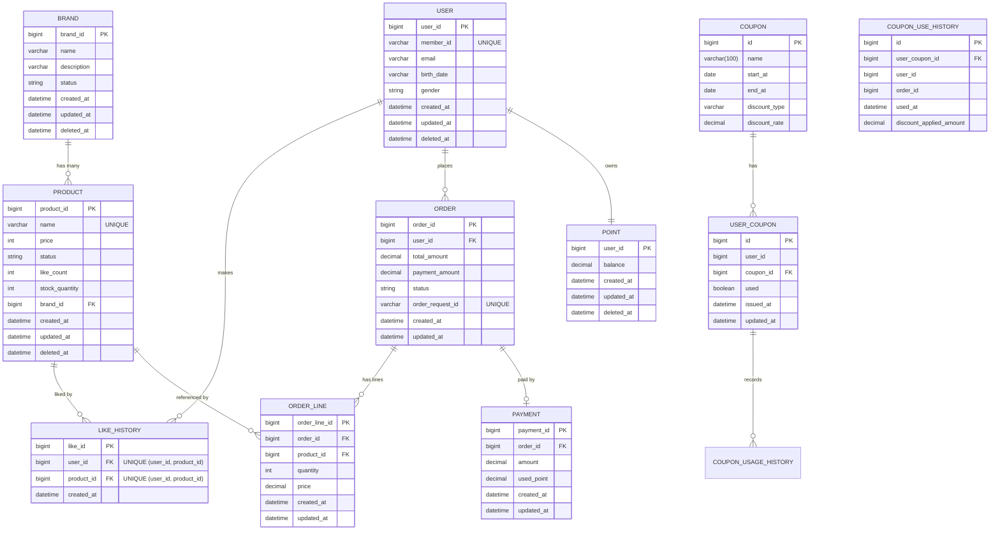

| ERD

---

```mermaid
erDiagram

%% =========================
%% Brand
%% =========================
BRAND {
    bigint brand_id PK
    varchar name
    varchar description
    string status
    datetime created_at
    datetime updated_at
    datetime deleted_at  
}

%% =========================
%% Product
%% =========================
PRODUCT {
    bigint product_id PK
    varchar name "UNIQUE"
    int price
    string status
    int like_count
    int stock_quantity
    bigint brand_id FK
    datetime created_at
    datetime updated_at
    datetime deleted_at
}

%% =========================
%% Like : Hard delete 
%% =========================
LIKE_HISTORY {
    bigint like_id PK
    bigint user_id FK "UNIQUE (user_id, product_id)"
    bigint product_id FK "UNIQUE (user_id, product_id)"
    datetime created_at    
}

%% =========================
%% Order
%% =========================
ORDER {
    bigint order_id PK
    bigint user_id FK
    decimal total_amount
    decimal payment_amount
    string status 
    varchar order_request_id "UNIQUE"
    datetime created_at
    datetime updated_at
}

ORDER_LINE {
    bigint order_line_id PK
    bigint order_id FK
    bigint product_id FK
    int quantity
    decimal price
    datetime created_at
    datetime updated_at
    %% UNIQUE (order_id, product_id) 조합
}

%% =========================
%% Payment
%% =========================
PAYMENT {
    bigint payment_id PK
    bigint order_id FK
    decimal amount
    decimal used_point
    datetime created_at
    datetime updated_at
}

%% =========================
%% User
%% =========================
USER {
    bigint user_id PK
    varchar member_id "UNIQUE"
    varchar email 
    varchar birth_date
    string gender
    datetime created_at
    datetime updated_at
    datetime deleted_at
}

%% =========================
%% Point
%% =========================
POINT {
    bigint user_id PK
    decimal balance
    datetime created_at
    datetime updated_at
    datetime deleted_at
}

%% =========================
%% coupon
%% =========================
COUPON {
    bigint id PK
    varchar(100) name
    date start_at
    date end_at
    varchar discount_type
    decimal discount_rate
}

USER_COUPON {
    bigint id PK
    bigint user_id
    bigint coupon_id FK
    boolean used   
    datetime issued_at
    datetime updated_at
}

COUPON_USE_HISTORY {
    bigint id PK
    bigint user_coupon_id FK
    bigint user_id
    bigint order_id
    datetime used_at
    decimal discount_applied_amount
}


%% =========================
%% 관계
%% =========================
BRAND ||--o{ PRODUCT : "has many"
PRODUCT ||--o{ LIKE_HISTORY : "liked by"
USER ||--o{ LIKE_HISTORY : "makes"
ORDER ||--o{ ORDER_LINE : "has lines"
PRODUCT ||--o{ ORDER_LINE : "referenced by"
ORDER ||--o| PAYMENT : "paid by"
USER ||--o{ ORDER : "places"
USER ||--|| POINT : "owns"
COUPON ||--o{ USER_COUPON : "has"
USER_COUPON ||--o{ COUPON_USAGE_HISTORY : "records"

```